# Face
Some operations about face: transformation、projection.
## 1.变换
变换的本质：一个矩阵就是一个线性变换
### 1.1 向量相乘
#### 1.1.1 点乘
两个向量的点乘等于它们的数乘结果乘以两个向量之间夹角的余弦值：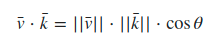

你也可以通过点乘的结果计算两个非单位向量的夹角，点乘的结果除以两个向量的长度之积，得到的结果就是夹角的余弦值，即cosθ。

译注：通过上面点乘定义式可推出：

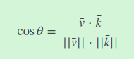

点乘在计算光照的时候特别有用。
#### 1.4 叉乘
叉乘只在3D空间中有定义，它需要两个不平行向量作为输入，生成一个正交于两个输入向量的第三个向量。如果输入的两个向量也是正交的，那么叉乘之后将会产生3个互相正交的向量。

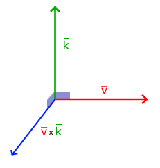

叉乘表达式：

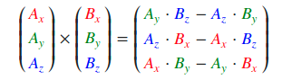
### 1.2 矩阵与向量相乘
**很多有趣的2D/3D变换都可以放在一个矩阵中，用这个矩阵乘以我们的向量将变换(Transform)这个向量。**

#### 1.2.1 缩放
对一个向量进行缩放(Scaling)就是对向量的长度进行缩放，而保持它的方向不变。由于我们进行的是2维或3维操作，我们可以分别定义一个有2或3个缩放变量的向量，每个变量缩放一个轴(x、y或z)。
如果我们把缩放变量表示为(S1,S2,S3)我们可以为任意向量(x,y,z)定义一个缩放矩阵：

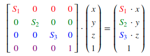

***注意，第四个缩放向量仍然是1，因为在3D空间中缩放w分量是无意义的。***

### 1.2.2 位移
位移(Translation)是在原始向量的基础上加上另一个向量从而获得一个在不同位置的新向量的过程，从而在位移向量基础上移动了原始向量。 

如果我们把位移向量表示为(Tx,Ty,Tz)，我们就能把位移矩阵定义为：

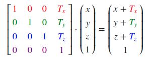

齐次坐标(Homogeneous Coordinates)

向量的w分量也叫齐次坐标。想要从齐次向量得到3D向量，我们可以把x、y和z坐标分别除以w坐标。我们通常不会注意这个问题，因为w分量通常是1.0。使用齐次坐标有几点好处：它允许我们在3D向量上进行位移（如果没有w分量我们是不能位移向量的），我们可以用w值创建3D视觉效果。

如果一个向量的齐次坐标是0，这个坐标就是方向向量(Direction Vector)，因为w坐标是0，这个向量就不能位移（译注：这也就是我们说的不能位移一个方向）。

### 1.2.3 旋转
转半圈会旋转360/2 = 180度，向右旋转1/5圈表示向右旋转360/5 = 72度。下图中展示的2D向量v是由k向右旋转72度所得的：

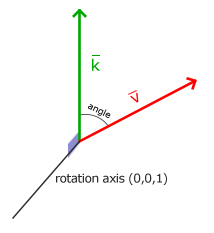

在3D空间中旋转需要定义一个角和一个旋转轴(Rotation Axis)。物体会沿着给定的旋转轴旋转特定角度。如果你想要更形象化的感受，可以试试向下看着一个特定的旋转轴，同时将你的头部旋转一定角度。当2D向量在3D空间中旋转时，我们把旋转轴设为z轴（尝试想象这种情况）。
旋转矩阵在3D空间中每个单位轴都有不同定义，旋转角度用θ表示：

沿x轴旋转：

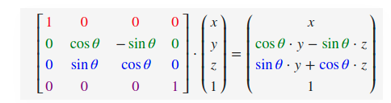

沿y轴旋转(注意沿Y轴的变换与其他轴略有不同)：

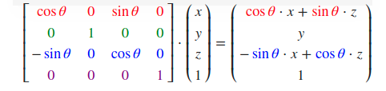

沿z轴旋转：

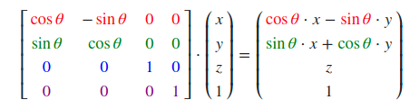

利用旋转矩阵我们可以把任意位置向量沿一个单位旋转轴进行旋转。也可以将多个矩阵复合，比如先沿着x轴旋转再沿着y轴旋转。但是这会很快导致一个问题——万向节死锁（Gimbal Lock）。在这里我们不会讨论它的细节，但是对于3D空间中的旋转，一个更好的模型是沿着任意的一个轴，比如单位向量$(0.662, 0.2, 0.7222)$旋转，而不是对一系列旋转矩阵进行复合。
***即使这样一个矩阵也不能完全解决万向节死锁问题（尽管会极大地避免）。避免万向节死锁的真正解决方案是使用四元数(Quaternion)，它不仅更安全，而且计算会更有效率。***

### 1.2.4 矩阵的组合
使用矩阵进行变换的真正力量在于，根据矩阵之间的乘法，我们可以把多个变换组合到一个矩阵中。让我们看看我们是否能生成一个变换矩阵，让它组合多个变换。假设我们有一个顶点(x, y, z)，我们希望将其缩放2倍，然后位移(1, 2, 3)个单位。我们需要一个位移和缩放矩阵来完成这些变换。结果的变换矩阵看起来像这样：

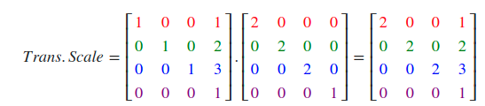

注意，当矩阵相乘时我们先写位移再写缩放变换的。矩阵乘法是不遵守交换律的，这意味着它们的顺序很重要。当矩阵相乘时，在最右边的矩阵是第一个与向量相乘的，所以你应该从右向左读这个乘法。建议您在组合矩阵时，先进行缩放操作，然后是旋转，最后才是位移，否则它们会（消极地）互相影响。比如，如果你先位移再缩放，位移的向量也会同样被缩放（译注：比如向某方向移动2米，2米也许会被缩放成1米）！

用最终的变换矩阵左乘我们的向量会得到以下结果：

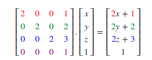

